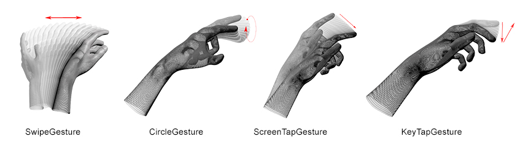
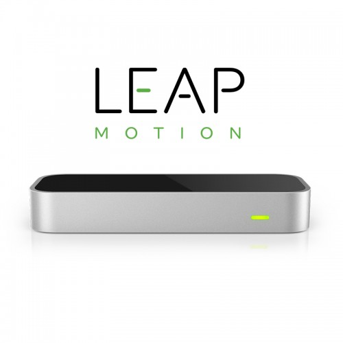
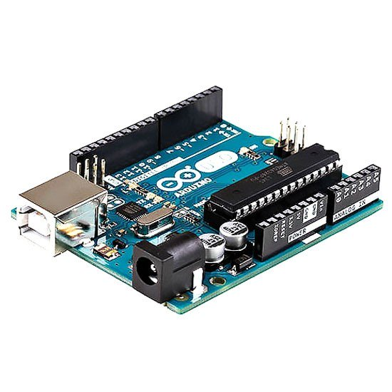
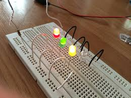
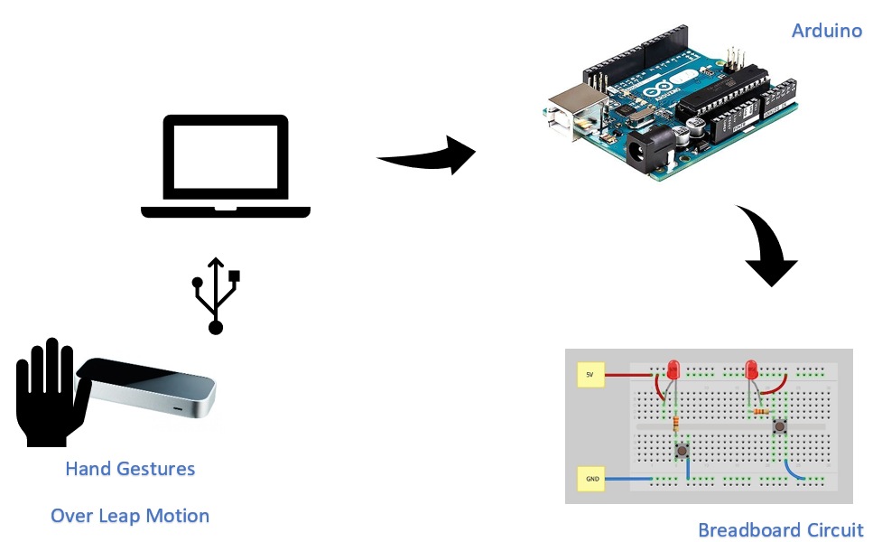

# Project Details

| Project Details   |     |
| --- | --- |
| **Course** | BSc (Hons) in Software Development  |
| **Module** |  Gesture Based User Interface Development |
| **Members** | [Derrick Conway](https://github.com/DerrickConway)  [Gary Mannion](https://github.com/Gazza1996)|

## Brief
Develop an application with a Natural User Interface. There are a number of options available to
you and this is an opportunity to combine a lot of technology that you have worked with over the
past four years.

## Purpose of the application
The main purpose of our application is to implement basic gestures over the controller and have each specific gesture light up a specific led light colour.  Our project will involve the leap motion controller and having it connected with the arduino board using a Node JS library running some commands which will in turn lead to us using some hand gestures on the leap motion and being able to then send a signal to a circuit board with some led lights pinned to it which will ommit a colour for a certain gesture.

The application will be an experimental based idea showing how we can use these technologies to develop applications that involve using specific hand gestures. The idea of using the circuit board will the LEDs is to back up our idea that the hand gestures are being recognised by using different colours for each gesture.

## Research
We had a great choice of technologies to use for this project from our Gesture Based UI module. We used different technolgies during our labs in order to gain a small amount of knowledge as to how they work and also to give us some ideas for use in our project. The college had a range of tech that we could have used for example they had [Kinect](https://en.wikipedia.org/wiki/Kinect) , [Myo Armband](https://www.myo.com/) , and [Leap motion Controller](https://www.leapmotion.com/). We both had decided before any research that we would either be using raspberry pi and arduino or just arduino for our project as we both an in interest in the tech and wanted to use one of them in a project to gain some knowledge on them. As students we didn't want to invest too much on these tech as we can't afford too, so the arduino with the leap motion(which we can use from the college) was our best idea.

### First Idea
- Our first idea we thought out was using an arduino and having a camera plugged into it and by using this camera we would be able to recognise some different hand gestures or movements.

### Second Idea
- After more research and learning about how the Leap Motion works we decided to go down a different path. We would be keeping our arduino but get rid of the camera plugin and instead use a breadboard for our lights while our Leap Motion would be detecting our hand gestures.

## Gestures identified as appropriate for this application
After researching the Leap Motion controller we discovered that the controller supports various hand gestures which in the end we decided to go with following:

Our main reason for choosing the above as the hand gestures for our project was that we believed these would be the most popular to be used in an application. 

- The swipe gestures is most popular in regards to moving between pages or controller the direction of an object
- The circle gesture could be incorporated into an application where a drag & drop feature is added or in a game wich requires you to throw something.
- The screenTap would be used in an app where you want to click on a button.
- The keyTap gesture can be used where we have an action where an app has a key press function.

Our objective here is to have all these gestures in our code and when one is performed a colour will light up for each one.

## Technology/Hardware Used

### Leap Motion Controller
The Leap Motion controller is a small USB peripheral device which is designed to be placed on a physical desktop, facing upward. It can also be mounted onto a virtual reality headset. Using two monochromatic IR cameras and three infrared LEDs, the device observes a roughly hemispherical area, to a distance of about 1 meter. The LEDs generate pattern-less IR light and the cameras generate almost 200 frames per second of reflected data. This is then sent through a USB cable to the host computer, where it is analyzed by the Leap Motion software using "complex maths" in a way that has not been disclosed by the company, in some way synthesizing 3D position data by comparing the 2D frames generated by the two cameras.

- Download the SDK from https://www.leapmotion.com/setup/linux; Here will be the option to download at windows which will start downloading an .exe file.

### Arduino
- Arduino is an open-source physical computing platform based on a simple I/O board and a development environment that implements the Processing/Wiring language. 

### BreadBoard Circuit
- Breadboard is retangular piece of plastic with a grid of holes that allows you to easily and quickly build an electronic circuits by pushing electronic components into the holes. Here is a similar one to one we used with come leds plugged into showing what we hope to implement.

## Architecture for the solution
From above we have our research section with our two ideas for the project. Below we have a diagram showing the architecture of our project clearly showing how everything will be connected up from our leap motion right around to our breadboard circuit.

## Technologies Assembled

## Demo Video

## Conclusion

## References
